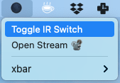
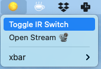

# xbar-foscam-ir-switcher

[xbar](xbarapp.com) plugin for switching [FOSCAM](https://www.foscam.com/) IR LEDs On/Off

## Installation

1. Copy `001-foscam-ir-switcher.10s.sh` into your xbar plugins folder (for eg. `~/Library/Application Support/xbar/plugins`)
1. Change `IP_ADDR`, `USERNAME`, `PASSWORD` in the [script](https://github.com/notthetup/xbar-foscam-ir-switcher/blob/master/001-foscam-ir-switcher.10s.sh#L14-L16)
1. Change permissions `chmod u+x 001-foscam-ir-switcher.10s.sh`
1. Click `Refresh All` in xbar menu

*NOTES:*

- Currently tested on FOSCAM C2
